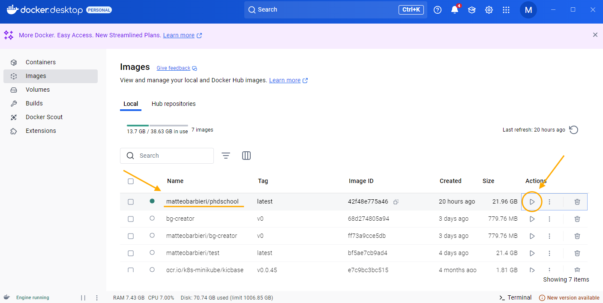
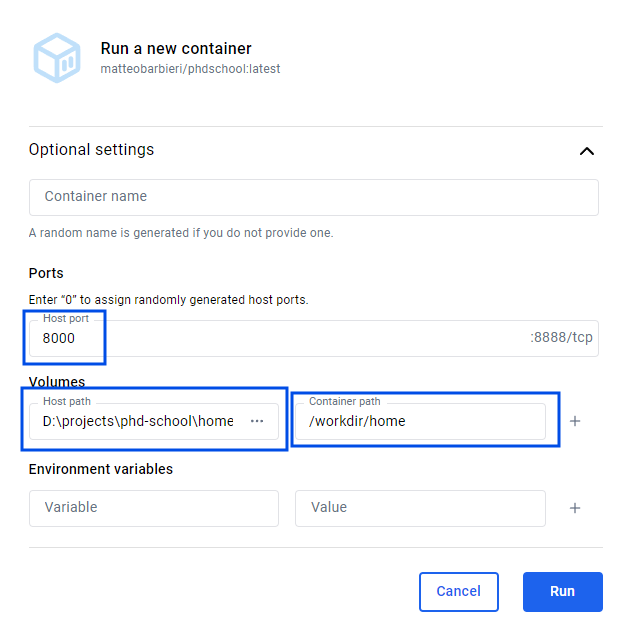

# Lab sessions

## Table of contents

* [System setup](#system-setup)
  * [Docker Desktop](#docker-desktop)
  * [Enabling virtualization](#enabling-virtualization)

## General notes

> TODO google stuff

## System setup

In order to be able to code along the lab sessions, you will need to do some setup beforehand.

Note that most of these steps require an internet connection, so take that into account when planning. The entire process will likely take between 30 and 60 minutes depending on your system, so **plan ahead**.

### Docker Desktop

You need to be able to run _containers_ on your machine. If you haven't already docker installed on your system, you need to set it up now.

The easiest way to do that probably is to install [Docker Desktop](https://www.docker.com/products/docker-desktop/). Follow the instruction on the website to have it installed on your machine. **You don't need to create an account/sign in**, you can skip to the [Get started](https://www.docker.com/get-started/) section and download the right installer for your system.

#### Enabling virtualization

Once you have installed docker desktop, you may still need to do an extra step before you can actually use it. Docker requires some specific functionality enabled on your machine, which may be not enabled by default.

If docker complains that you need to "enable virtualization" on your machine, you probably need to do that by accessing your machine's BIOS.
This is done by pressing some specific key on the keyboard when the machine is starting up (i.e. right after you turn it on, **before** Windows starts loading). The exact key to press depends on the machine, usually it's one of the `F` keys (like `F8` or `F12`), or `DEL` (it will appear for a few seconds when you turn on the PC, it might take you a few tries to get the timing right).

Once you enter the BIOS, you need to find the section where you can enable the virtualization functionality. Again, the exact place is different for every machine type, so you may have to do some googling. A good start is searching something like `<BIOS NAME> enable virtualization` or `<MACHINE MODEL> enable virtualization`.

### [Optional] Git

Install [git](https://git-scm.com/) on your system.

### [Optional, but suggested] Make

Install [make](https://stackoverflow.com/questions/32127524/how-to-install-and-use-make-in-windows) on your system.

### Clone/Download the repository

Simply clone this repository somewhere in your disk. The command from the terminal/powershell is `git clone https://github.com/matteobarbieri/phd-school.git`

Alternatively, if you don't have git installed, you can download the repository as a zip file from [this](https://github.com/matteobarbieri/phd-school/archive/refs/heads/main.zip) link.

## Running the lab

I prepared a docker image with all the tools installed for this lab session, since we may have limited connectivity during the day of the lab.

Once you have set up docker desktop, all you have to do is `pull` the image. The image is a bit big, so make sure you have like 30 GB free on your disk, or you may run into some problems.

From the terminal/powershell, enter command `docker pull matteobarbieri/phdschool`. It may take a while, since the image is a bit big.

> TODO change docker image path to local server

### Download data

The following instructions assume that you are running the commands from a terminal.

From the repository's root folder (the one named `phd-school`):

1. Create a folder named `data` inside folder `home` (`mkdir home/data`)
1. Enter that folder (`cd home/data`)
1. Download [this](https://www.dropbox.com/scl/fi/n6i5j75j5rgjez27qpw0n/MNIST_CSV.zip?rlkey=vc253rogq2gxdqearqrhv1ytf&dl=0) file in that folder
1. Extract the file

If all went well, you should now see the following structure inside the repository's root folder: `home/data/MNIST_CSV`. There should be **2** `.csv` files inside that folder (along with some more stuff): `mnist_test.csv` and `mnist_train.csv`.

> TODO add a python file to check that all files are there

### Start the container

From Docker Desktop's **image** tab, locate the row corresponding to the image you pulled before, it should be named `matteobarbieri/phdschool`. Click on the **Run** button on the right, as shown in the figure below.

This will open up a menu, click "Optional settings" to reveal more options.

You will need to:

- Enter value `8000` in the **port** field.
- Under **Volumes** section, click on the three dots in the "Host path" field. Navigate to the repository's folder on your disk, click on the `home` folder inside of it and click button "Select folder".
- Also under **Volumes**, enter `/workdir/home` in field "Container path".

If you have done everything correctly, it will look somewhat like this:

> TODO add command line equivalent code

Finally, open a browser and go to address [http://localhost:8000](http://localhost:8000). If everything worked, you should see the home page of the Jupyter environment.